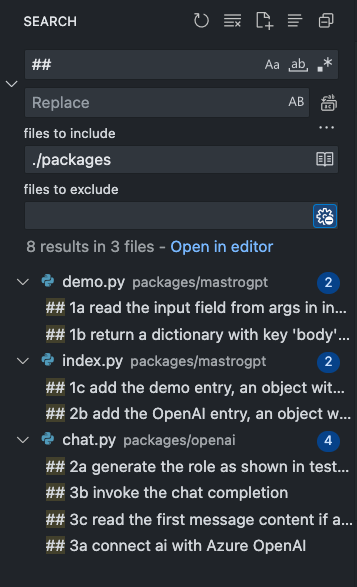
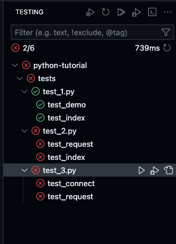

# Nuvolaris MastroGPT Tutorial

Learn to build easily AI applications with MastroGPT!

List of YouTube videos (italian with english subtitles)
- [Serverless Functions](https://youtu.be/qTSf3P0_b3M)

More to come!

## Prerequisites

To run this tutorial you need:

- A GitHub account (free!)
- A Nuvolaris.dev account (also free! request one here https://mastrogpt.nuvolaris.dev)

You can also install your own Nuvolaris Community if you want... check [here](https://nuvolaris.github.io) for more informations how to install it.

Launch this repository with CodeSpaces, eihter from Github or from the Nuvolaris Admin, then Login in Nuvolaris, and you are ready to start.

## How to run the tutorial

There is a presentation [here](docs/tutorial.md).

Open the markdown and preview it to see the slides (you need the marp VSCode plugin but you have it if you openend the repository the devcontainer).

The slides provides general informations, but more informations are also in the code.

The tutorial is interactive! You have to implement the exercises to progress.

You have to implement all the steps marked in source as '##'. 

Steps are numbered: `1a`, `1b`, `2a`, `2b`, `2c` and so on.

You can search for `##` in the folder `package` to find all the exercises:

Implement exercises in order (`1a`, `1b`, `1c`) then run the tests to ensure you did correctly.

Note that exercises are grouped: to pass `text_X` you need to implement all the `Xa`, `Xb`, ... `Xn`.

Enjoy!
